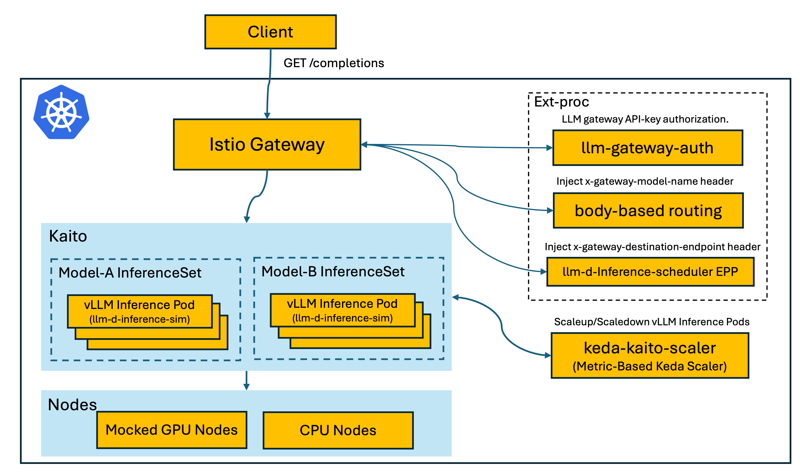

# Production Stack

This project provides a reference implementation on how to build an inference stack on top of [Kaito](https://github.com/kaito-project/kaito).

## Architecture

### Components

- **[Istio Gateway](https://istio.io/latest/docs/tasks/traffic-management/ingress/gateway-api/)** — Entry point for all inference requests. Routes client requests (e.g., `POST /v1/chat/completions`) through the stack.
- **[llm-gateway-auth](https://github.com/kaito-project/llm-gateway-auth)** — ext_authz API-key authorization filter. Validates the `Authorization: Bearer <token>` header against an `APIKey` custom resource resolved from the request's `Host` subdomain (`<namespace>.gw.example.com`) before any routing or model dispatch happens. Ships two components — `apikey-operator` (reconciles `APIKey` CRs into per-namespace Secrets) and `apikey-authz` (the ext_authz dataplane).
- **[Body-based Routing (BBR)](https://github.com/kubernetes-sigs/gateway-api-inference-extension/blob/main/pkg/bbr/README.md)** — Parses request body to extract the model name and injects the `X-Gateway-Model-Name` header, enabling model-level routing.
- **[llm-d-inference-scheduler (EPP)](https://github.com/llm-d/llm-d-inference-scheduler)** — Per-model Endpoint Picker (image `mcr.microsoft.com/oss/v2/llm-d/llm-d-inference-scheduler`). Performs KV-cache aware routing by injecting the `x-gateway-destination-endpoint` header, directing requests to the optimal inference pod.
- **[Kaito InferenceSet](https://github.com/kaito-project/kaito)** — Manages groups of vLLM inference pods. Multiple InferenceSets (e.g., Model-A, Model-B) can run different models simultaneously.
- **[vLLM Inference Pods](https://github.com/vllm-project/vllm)** — Serve model inference requests. On CPU-only E2E clusters, the real vLLM container is replaced by a **shadow pod** running [`llm-d-inference-sim`](https://github.com/llm-d/llm-d-inference-sim) (image `ghcr.io/llm-d/llm-d-inference-sim`), a lightweight vLLM-compatible simulator that exposes the same OpenAI API and `vllm:*` Prometheus metrics. See [`pkg/gpu-node-mocker/README.md`](pkg/gpu-node-mocker/README.md) for the original-pod ↔ shadow-pod mechanism.
- **[Kaito-Keda-Scaler](https://github.com/kaito-project/keda-kaito-scaler)** — Metric-based autoscaler built on [KEDA](https://keda.sh/) that scales vLLM inference pods up and down based on workload metrics.
- **Mocked GPU Nodes / CPU Nodes** — Infrastructure layer providing compute resources for inference workloads. The `gpu-node-mocker` controller (E2E-only) fakes GPU nodes on CPU-only clusters and runs the `llm-d-inference-sim` shadow pods on real CPU nodes.

## Resource Layering

Production Stack resources are organised into three tiers by scope and
lifecycle. Operators provision the lower tiers once per cluster; users
provision a model deployment per workload.

### 1. Cluster tier (one-time, cluster-wide)

Installed by [`hack/e2e/scripts/install-components.sh`](hack/e2e/scripts/install-components.sh)
(or its production equivalent). These components live across multiple
namespaces and are shared by every model deployment:

| Component                            | Namespace        | Version (`versions.env`)                | Install method | Role                                                                                  |
| ------------------------------------ | ---------------- | --------------------------------------- | -------------- | ------------------------------------------------------------------------------------- |
| KAITO workspace controller           | `kaito-system`   | latest chart, image `nightly-latest`    | helm           | Reconciles `InferenceSet` and provisions inference pods.                              |
| `gpu-node-mocker` (E2E-only)         | `kaito-system`   | repo `HEAD` (`SHADOW_CONTROLLER_IMAGE`) | helm           | Creates fake GPU nodes + shadow pods on CPU-only clusters.                            |
| Gateway API CRDs                     | _cluster-scoped_ | `GATEWAY_API_VERSION` (v1.2.0)          | kubectl        | Required for `Gateway`, `HTTPRoute`, `ReferenceGrant`.                                |
| Istio control plane (`istiod`)       | `istio-system`   | `ISTIO_VERSION` (1.29.2)                | istioctl       | Implements the Gateway dataplane (Envoy) and ext_proc filter chain.                   |
| GAIE CRDs                            | _cluster-scoped_ | latest                                  | kubectl        | `InferencePool`, `InferenceObjective`.                                                |
| BBR (Body-Based Router)              | `istio-system`   | `BBR_VERSION` (v1.3.1)                  | helm           | Installed in Istio's rootNamespace so its EnvoyFilter applies cluster-wide; injects `X-Gateway-Model-Name`. |
| `llm-gateway-auth` ([`kaito-project/llm-gateway-auth`](https://github.com/kaito-project/llm-gateway-auth)) | `llm-gateway-auth` | `LLM_GATEWAY_AUTH_VERSION` | helm           | API-key ext_authz for the `inference-gateway`. Installs the `APIKey` CRD, the `apikey-operator` (reconciles `APIKey` → per-namespace Secret), and the `apikey-authz` ext_authz dataplane wired into Istio via `MeshConfig` + `AuthorizationPolicy`. |
| KEDA + KEDA Kaito Scaler ([`kaito-project/keda-kaito-scaler`](https://github.com/kaito-project/keda-kaito-scaler), optional)  | `keda` | `KEDA_VERSION` (v2.19.0), `KEDA_KAITO_SCALER_VERSION` (v0.4.1) | helm | Workload-metric autoscaling.                                                    |

### 2. Namespace tier (one-time per environment / tenant)

These resources scope traffic into a Gateway dataplane and the API-key
auth policy for that gateway. A namespace may host one or more model
deployments that all share its Gateway:

| Resource                                                       | Where                     | Version              | Install method                       | Role                                                                                                                  |
| -------------------------------------------------------------- | ------------------------- | -------------------- | ------------------------------------ | --------------------------------------------------------------------------------------------------------------------- |
| `Gateway` (`gateway.networking.k8s.io/v1`)                     | Per namespace             | API `v1`             | `provisionNamespaceResources` (E2E)  | Public entry point; `gatewayClassName: istio`, HTTP/80.                                                               |
| Catch-all `HTTPRoute`                                          | Per namespace             | API `v1`             | `provisionNamespaceResources` (E2E)  | Routes unmatched paths on the per-case Gateway to the shared `default/model-not-found` Service so unknown models receive an OpenAI-compatible 404. |
| `ReferenceGrant` `allow-model-not-found-from-<ns>`             | `default`                 | API `v1beta1`        | `provisionNamespaceResources` (E2E)  | Authorises the per-namespace catch-all `HTTPRoute` to reference `default/model-not-found` across namespaces.          |
| `AuthorizationPolicy` `apikey-gateway-ext-authz` (auth-enabled) | Per namespace             | `security.istio.io/v1` | `provisionNamespaceResources` (E2E)  | Wires the per-case Gateway pod into the cluster-wide `apikey-ext-authz` CUSTOM provider (registered in `MeshConfig` by `llm-gateway-auth`); the upstream chart only installs an AP for the cluster-wide `inference-gateway`. |
| `APIKey` `default` (auth-enabled)                              | Per namespace             | `apikeys.kaito.sh/v1alpha1` | `provisionNamespaceResources` (E2E)  | Triggers the `apikey-operator` to reconcile a Secret (`llm-api-key`) holding the bearer token the test client / clients send.                       |

In the E2E suite these are provisioned by a single function,
[`provisionNamespaceResources`](test/e2e/utils/setup.go) — extend it
when a new per-namespace artifact is introduced. The two auth-related
resources (`AuthorizationPolicy`, `APIKey`) are skipped when a case
opts out of API-key auth.

> **Note:** The `default` namespace's equivalent resources are
> pre-provisioned by
> [`hack/e2e/scripts/install-components.sh`](hack/e2e/scripts/install-components.sh)
> during cluster setup, so `EnsureNamespace` short-circuits for it.

### 3. Workload tier (per model deployment)

Provisioned by the `charts/modeldeployment` Helm chart. One Helm release
per model deployment, parented to the namespace's `Gateway`:

| Resource                                         | Version (chart-rendered) | Install method | Role                                                                  |
| ------------------------------------------------ | ------------------------ | -------------- | --------------------------------------------------------------------- |
| `InferenceSet` (`kaito.sh/v1alpha1`)             | `v1alpha1`               | helm           | Reconciled by KAITO; renders inference pods running vLLM.             |
| `InferencePool` (`inference.networking.k8s.io/v1`) | `v1`                   | helm           | Selects the inference pods backing this deployment.                   |
| EPP `Deployment` + `Service` + RBAC + `ConfigMap` | `apps/v1`, `v1`, `rbac/v1` | helm         | Endpoint Picker (`llm-d-inference-scheduler`) for KV-cache aware routing. |
| `HTTPRoute` (`gateway.networking.k8s.io/v1`)     | `v1`                     | helm           | Matches `X-Gateway-Model-Name == <name>` on the namespace's Gateway and forwards to the InferencePool. |

The chart's `name` value is the per-deployment routing key; `model` is
the underlying KAITO preset. See the
[`charts/modeldeployment` chart README](charts/modeldeployment/README.md)
for the full value schema and install examples.

## Resource Reference

A flat index of the **CRD-backed** resources Production Stack creates,
grouped by the controller / chart that owns it. Kubernetes native objects
(`Deployment`, `Service`, `ConfigMap`, `ServiceAccount`, `Role` /
`RoleBinding`, `Pod`, `Node`, …) are intentionally omitted — they are
implementation details of the charts above and are not listed here.

| Resource (Kind) | Group / Version | Source | Purpose |
| --- | --- | --- | --- |
| `Workspace` | `kaito.sh/v1alpha1` | KAITO | Aggregates inference workloads (used indirectly via `InferenceSet`). |
| `InferenceSet` | `kaito.sh/v1alpha1` | KAITO | Declares one model deployment; KAITO renders inference pods. |
| `InferencePool` | `inference.networking.k8s.io/v1` | Gateway API Inference Extension (GAIE) | GAIE pool selecting the inference pods backing a deployment. |
| `InferenceObjective` | `inference.networking.k8s.io/v1` | Gateway API Inference Extension (GAIE) | API object defining objective contracts; CRD only — not authored by this stack. |
| `APIKey` | `apikeys.kaito.sh/v1alpha1` | [`kaito-project/llm-gateway-auth`](https://github.com/kaito-project/llm-gateway-auth) | Declares an API key for a gateway namespace; the `apikey-operator` reconciles it into a `Secret` (`llm-api-key` by default) consumed by the `apikey-authz` ext_authz filter. |
| `Gateway` | `gateway.networking.k8s.io/v1` | Kubernetes Gateway API | Per-namespace public entry point; `gatewayClassName: istio`, HTTP/80. |
| `HTTPRoute` | `gateway.networking.k8s.io/v1` | Kubernetes Gateway API | Model-specific routes match `X-Gateway-Model-Name == <name>` → InferencePool; catch-all routes unmatched paths to `default/model-not-found` for an OpenAI 404. |
| `ReferenceGrant` | `gateway.networking.k8s.io/v1beta1` | Kubernetes Gateway API | Authorises the per-namespace catch-all `HTTPRoute` to reference `default/model-not-found`. |
| `EnvoyFilter` | `networking.istio.io/v1alpha3` | Istio | BBR injects ext_proc into every Istio Gateway via rootNamespace; debug filter adds a Lua `PRE-BBR` / `POST-EPP` / `RESPONSE` log chain for E2E. |
| `AuthorizationPolicy` | `security.istio.io/v1` | Istio (rendered by `llm-gateway-auth`) | Targets the `inference-gateway` Pod and routes ext_authz to the `apikey-authz` provider so every request must carry a valid `APIKey`-derived bearer token. |

## Testing

The E2E suite under [`test/e2e/`](test/e2e) exercises the full stack
(Gateway → llm-gateway-auth (ext_authz) → BBR → EPP
(`llm-d-inference-scheduler`) → vLLM shadow pod
(`llm-d-inference-sim`)) against a live AKS cluster. Tests run as
parallel `Ordered` Ginkgo Describes, one per case namespace.

See [`test/e2e/README.md`](test/e2e/README.md) for the full framework
guide, helper API, and the
[**Adding a new e2e test**](test/e2e/README.md#adding-a-new-e2e-test)
workflow.

## License

Production Stack is licensed under the [Apache License 2.0](LICENSE).

