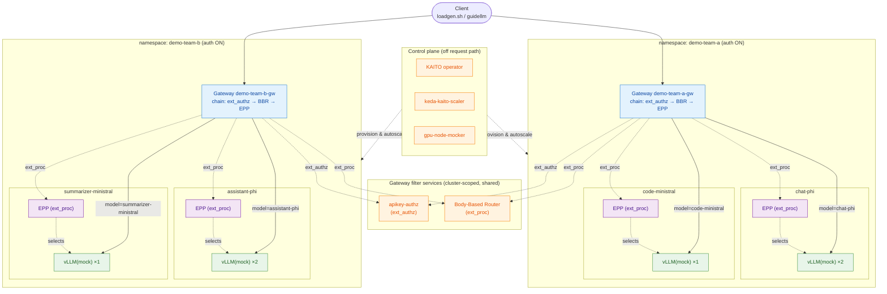

# Multi-tenant inference on production-stack: cluster bring-up + multiple ModelHarness / ModelDeployment

This demo walks through a complete, reproducible deployment of the
production-stack on a fresh **AKS** cluster and then layers a realistic
multi-tenant workload on top of it:

1. **Cluster bring-up** — use the scripts under [`hack/e2e/scripts`](../hack/e2e/scripts)
   to create an AKS cluster and install every cluster-scoped component
   (Istio, KEDA, Gateway API + GAIE CRDs, KAITO, BBR, the API-key auth
   control plane, and the `gpu-node-mocker`).
2. **Workload provisioning** — install **two** `modelharness` releases (one
   per workload namespace), each hosting **two** `modeldeployment` releases,
   with **at least one** deployment running **multiple replicas**.
3. **Traffic generation** — drive OpenAI-style chat-completion traffic at a
   configurable QPS with [`hack/loadgen.sh`](../hack/loadgen.sh)
   (built-in `curl` engine or `guidellm`).

> The cluster uses the [`gpu-node-mocker`](../pkg/gpu-node-mocker) so the
> inference pods come up on **mocked GPU nodes** — no real GPU quota is
> required to exercise the full Gateway → BBR → EPP → vLLM(mock) request
> path end to end.

---

## Prerequisites

| Tool | Used for |
| --- | --- |
| `az` (logged in: `az login`) | create the AKS cluster / ACR |
| `docker` (daemon running) | build & push the `gpu-node-mocker` image |
| `kubectl` | talk to the cluster |
| `helm` (v3+) | install the charts |
| `python3`, `jq` | helper utilities used by the scripts |
| `guidellm` *(optional)* | only for `--engine guidellm`; auto-installed via `pip` on demand |

All component versions (Istio, KEDA, Gateway API, AKS K8s version) are pinned
in [`versions.env`](../versions.env) and sourced automatically by the
`run-e2e-local.sh` wrapper used below.

---

## Topology produced by this demo

Each request follows the same path: the client hits the per-namespace Istio
`Gateway`, whose HTTP filter chain runs **ext_authz** (API-key check against the
cluster-wide `apikey-authz`) → **BBR** ext_proc (reads the body, injects
`X-Gateway-Model-Name`) → the **EPP** ext_proc. The `HTTPRoute` matches on
`X-Gateway-Model-Name` to pick the model's `InferencePool`, the EPP ext_proc
selects one of that pool's replicas, and the Gateway then forwards the prompt to
the chosen `vLLM(mock)` pod. KAITO, the KEDA scaler and the `gpu-node-mocker`
provision and autoscale the pods off the request path.



| Namespace | ModelHarness | ModelDeployment | Preset | Replicas (min) | Autoscaling (max / up-threshold) |
| --- | --- | --- | --- | --- | --- |
| `demo-team-a` | auth **on** | `chat-phi` | `phi-4-mini-instruct` | **2** | 4 / 5 |
| `demo-team-a` |  | `code-ministral` | `ministral-3-3b-instruct` | 1 | 3 / 5 |
| `demo-team-b` | auth **on** | `assistant-phi` | `phi-4-mini-instruct` | **2** | 4 / 5 |
| `demo-team-b` |  | `summarizer-ministral` | `ministral-3-3b-instruct` | 1 | 3 / 5 |

This satisfies the demo's goals: **2 `modelharness`**, **2 `modeldeployment`
each**, and **multiple deployments with `replicas > 1`**. Every deployment also
has **KAITO autoscaling enabled** (`enableScaling=true`): the `keda-kaito-scaler`
provisions a `ScaledObject` that scales each `InferenceSet` between its
`replicas` baseline and `maxReplicas`. Scaling is driven by the chart's composite
`scaling.metrics` list — the two chart defaults, per-replica queue depth
(`vllm:num_requests_waiting`, gauge) and p95 request-queue time
(`vllm:request_queue_time_seconds`, histogram) — that `keda-kaito-scaler` v0.6.1
combines under a conservative **AND** policy: it scales up by one replica only
when *both* signals exceed their `upThreshold`, and scales down only when *both*
fall below their `downThreshold`.

---

## Part 1 — Create the AKS cluster and install cluster-scoped components

All commands are run from the repository root.

### 1.1 Pick names for the run

These names are shared by `prepare-image.sh` (which derives the ACR name from
`CLUSTER_NAME`) and `setup-cluster.sh` (which attaches that ACR), so export
them once in your shell:

```sh
export RESOURCE_GROUP=ps-demo-rg
export CLUSTER_NAME=ps-demo-aks
export LOCATION=australiaeast
export NODE_COUNT=3
export NODE_VM_SIZE=Standard_D8s_v5
```

### 1.2 Create the resource group + ACR and build/push the mocker image

[`prepare-image.sh`](../hack/e2e/scripts/prepare-image.sh) is idempotent: it
creates the resource group and ACR (if missing) and builds + pushes the
`gpu-node-mocker` image. Its **last stdout line** is `image=<acr-fqdn>/gpu-node-mocker:<tag>` —
capture it for the install step:

```sh
export SHADOW_CONTROLLER_IMAGE="$(hack/e2e/scripts/prepare-image.sh | sed -n 's/^image=//p')"
echo "Built image: ${SHADOW_CONTROLLER_IMAGE}"
```

### 1.3 Create the AKS cluster + cluster-prep components

[`run-e2e-local.sh setup`](../hack/e2e/scripts/run-e2e-local.sh) sources
[`versions.env`](../versions.env), then calls
[`setup-cluster.sh`](../hack/e2e/scripts/setup-cluster.sh), which:

- creates the AKS cluster (Azure CNI overlay + **Cilium** dataplane/policy),
- fetches the kubeconfig and waits for nodes + Cilium to be Ready,
- installs **KEDA**, the **Gateway API base CRDs**, and **Istio** (in parallel).

```sh
hack/e2e/scripts/run-e2e-local.sh setup
```

### 1.4 Install the remaining cluster-scoped components

[`run-e2e-local.sh install`](../hack/e2e/scripts/run-e2e-local.sh) calls
[`install-components.sh`](../hack/e2e/scripts/install-components.sh), which
installs (in parallel): **KAITO** workspace operator, the **GAIE/GWIE CRDs**,
the **gpu-node-mocker**, and the **productionstack** umbrella chart (BBR,
`keda-kaito-scaler`, and the `llm-gateway-apikey` auth control plane).

```sh
# SHADOW_CONTROLLER_IMAGE from step 1.2 is required here.
hack/e2e/scripts/run-e2e-local.sh install
```

### 1.5 Validate

[`validate-components.sh`](../hack/e2e/scripts/validate-components.sh) asserts
every control-plane component is healthy:

```sh
hack/e2e/scripts/run-e2e-local.sh validate
```

You should see ✅ lines for KAITO, gpu-node-mocker, istiod, BBR, KEDA,
keda-kaito-scaler, and apikey-operator.

> **Tip:** `setup` / `install` / `validate` are separate sub-commands so you
> can re-run an individual phase. To run everything (including the Go e2e
> suite and teardown) in one shot, use `hack/e2e/scripts/run-e2e-local.sh all`.

---

## Part 2 — Install two ModelHarness, each with two ModelDeployment

Each workload namespace gets **one** `modelharness` release that provisions
the shared resources every model in that namespace needs:

- the per-namespace Istio `Gateway` `"<namespace>-gw"` that fronts the namespace,
- the catch-all `EnvoyFilter` (`model-not-found-direct`) that returns an
  OpenAI-compatible `404 model_not_found` straight from Envoy for any
  unknown-model path,
- the per-namespace `EnvoyFilter` that injects BBR's ext_proc into the
  Gateway HCM,
- the unified-error `local_reply` `EnvoyFilter` that maps fail-closed
  BBR / ext_authz outages and any remaining `>= 500` reply onto a consistent
  OpenAI-compatible error envelope,
- (when `auth.enabled`) the `AuthorizationPolicy` + `APIKey` CR that wire the
  Gateway into the cluster-wide `apikey-ext-authz` provider,
- (when `networkPolicy.enabled`) a `CiliumNetworkPolicy` that locks down
  East-West ingress to the namespace's inference workloads.

Each namespace then hosts **two** `modeldeployment` releases that parent into
that shared Gateway.

### 2.1 `demo-team-a` (API-key auth enabled, one multi-replica model)

`auth.enabled=true` makes the harness render the per-namespace
`AuthorizationPolicy` + `APIKey` CR; the `apikey-operator` mints a
`llm-api-key` Secret in the namespace that clients send as a bearer token.

```sh
# Per-namespace harness (Gateway demo-team-a-gw, BBR, catch-all 404, netpol, auth).
helm upgrade --install modelharness charts/modelharness \
  --namespace demo-team-a --create-namespace \
  --set namespace=demo-team-a \
  --set auth.enabled=true \
  --wait --timeout=5m

# Model #1 — phi, 2 replicas (multi-replica), autoscale 2→4.
helm upgrade --install chat-phi charts/modeldeployment \
  --namespace demo-team-a \
  --set name=chat-phi \
  --set namespace=demo-team-a \
  --set model=phi-4-mini-instruct \
  --set replicas=2 \
  --set enableScaling=true \
  --set maxReplicas=4 \
  --set enableBenchmark=false \
  --set scaling.metrics[0].name=vllm:num_requests_waiting \
  --set scaling.metrics[0].type=gauge \
  --set scaling.metrics[0].upThreshold=5 \
  --set scaling.metrics[0].downThreshold=2 \
  --set scaling.metrics[1].name=vllm:request_queue_time_seconds \
  --set scaling.metrics[1].type=histogram \
  --set scaling.metrics[1].upThreshold=2 \
  --set scaling.metrics[1].downThreshold=0.5 \
  --set scaling.metrics[1].quantile=0.95 \
  --set instanceType=Standard_NV36ads_A10_v5 \
  --wait --timeout=10m

# Model #2 — ministral, 1 replica, autoscale 1→3.
helm upgrade --install code-ministral charts/modeldeployment \
  --namespace demo-team-a \
  --set name=code-ministral \
  --set namespace=demo-team-a \
  --set model=ministral-3-3b-instruct \
  --set replicas=1 \
  --set enableScaling=true \
  --set maxReplicas=3 \
  --set enableBenchmark=false \
  --set scaling.metrics[0].name=vllm:num_requests_waiting \
  --set scaling.metrics[0].type=gauge \
  --set scaling.metrics[0].upThreshold=5 \
  --set scaling.metrics[0].downThreshold=2 \
  --set scaling.metrics[1].name=vllm:request_queue_time_seconds \
  --set scaling.metrics[1].type=histogram \
  --set scaling.metrics[1].upThreshold=2 \
  --set scaling.metrics[1].downThreshold=0.5 \
  --set scaling.metrics[1].quantile=0.95 \
  --set instanceType=Standard_NV36ads_A10_v5 \
  --wait --timeout=10m
```

### 2.2 `demo-team-b` (API-key auth enabled, one multi-replica model)

Same harness as `demo-team-a` — auth scope is per-namespace, so flipping
`auth.enabled=true` here mints a `demo-team-b`-local `llm-api-key` Secret
independent of `demo-team-a`'s.

```sh
helm upgrade --install modelharness charts/modelharness \
  --namespace demo-team-b --create-namespace \
  --set namespace=demo-team-b \
  --set auth.enabled=true \
  --wait --timeout=5m

# Model #1 — phi, 2 replicas (multi-replica), autoscale 2→4.
helm upgrade --install assistant-phi charts/modeldeployment \
  --namespace demo-team-b \
  --set name=assistant-phi \
  --set namespace=demo-team-b \
  --set model=phi-4-mini-instruct \
  --set replicas=2 \
  --set enableScaling=true \
  --set maxReplicas=4 \
  --set enableBenchmark=false \
  --set scaling.metrics[0].name=vllm:num_requests_waiting \
  --set scaling.metrics[0].type=gauge \
  --set scaling.metrics[0].upThreshold=5 \
  --set scaling.metrics[0].downThreshold=2 \
  --set scaling.metrics[1].name=vllm:request_queue_time_seconds \
  --set scaling.metrics[1].type=histogram \
  --set scaling.metrics[1].upThreshold=2 \
  --set scaling.metrics[1].downThreshold=0.5 \
  --set scaling.metrics[1].quantile=0.95 \
  --set instanceType=Standard_NV36ads_A10_v5 \
  --wait --timeout=10m

# Model #2 — ministral, 1 replica, autoscale 1→3.
helm upgrade --install summarizer-ministral charts/modeldeployment \
  --namespace demo-team-b \
  --set name=summarizer-ministral \
  --set namespace=demo-team-b \
  --set model=ministral-3-3b-instruct \
  --set replicas=1 \
  --set enableScaling=true \
  --set maxReplicas=3 \
  --set enableBenchmark=false \
  --set scaling.metrics[0].name=vllm:num_requests_waiting \
  --set scaling.metrics[0].type=gauge \
  --set scaling.metrics[0].upThreshold=5 \
  --set scaling.metrics[0].downThreshold=2 \
  --set scaling.metrics[1].name=vllm:request_queue_time_seconds \
  --set scaling.metrics[1].type=histogram \
  --set scaling.metrics[1].upThreshold=2 \
  --set scaling.metrics[1].downThreshold=0.5 \
  --set scaling.metrics[1].quantile=0.95 \
  --set instanceType=Standard_NV36ads_A10_v5 \
  --wait --timeout=10m
```

### 2.3 Wait for the inference pods

`helm --wait` returns once the chart-owned Deployments (the EPP) are ready,
but the InferenceSet's inference pods are reconciled by KAITO (and patched
Running by the `gpu-node-mocker`). Wait for them explicitly:

```sh
for ns_model in \
  "demo-team-a:chat-phi:2" "demo-team-a:code-ministral:1" \
  "demo-team-b:assistant-phi:2" "demo-team-b:summarizer-ministral:1"; do
  ns="${ns_model%%:*}"; rest="${ns_model#*:}"; name="${rest%%:*}"; want="${rest##*:}"
  echo "── waiting for ${want} inference pod(s) of ${name} in ${ns} ──"
  kubectl -n "${ns}" wait --for=condition=ready pod \
    -l "inferenceset.kaito.sh/created-by=${name}" --timeout=10m
done
```

Inspect what you built:

```sh
kubectl get modelharness,modeldeployment -A 2>/dev/null || true
helm list -A | grep -E 'modelharness|chat-phi|code-ministral|assistant-phi|summarizer-ministral'
kubectl get gateway,httproute,inferencepool,inferenceset -n demo-team-a
kubectl get gateway,httproute,inferencepool,inferenceset -n demo-team-b
```

---

## Part 3 — Send prompts at a target QPS

> **Note:** `loadgen.sh` drives traffic from your local machine via
> `kubectl port-forward`, so it needs a working kubeconfig for the cluster.
> If you ran Parts 1–2 in this same shell you're already set; if you're on a
> fresh machine/terminal, re-fetch it first:
> `az aks get-credentials -g "${RESOURCE_GROUP}" -n "${CLUSTER_NAME}" --overwrite-existing`

[`hack/loadgen.sh`](../hack/loadgen.sh) auto-discovers
the model name and the per-namespace Gateway, starts (and cleans up) its own
`kubectl port-forward`, auto-detects API-key auth, and drives traffic at a
target QPS. See `--help` for the full option list.

### 3.1 Built-in `curl` engine (default)

```sh
# Both namespaces have auth ON — the script auto-reads the llm-api-key Secret
# and sends the bearer token + the <ns>.gw.kaito.sh Host header for you.

# 5 QPS for 30s against the auto-discovered first model in demo-team-a (chat-phi).
hack/loadgen.sh -n demo-team-a -q 5 -d 30

# Target the second model explicitly, 3 QPS for 20s.
hack/loadgen.sh -n demo-team-a -m code-ministral -q 3 -d 20

hack/loadgen.sh -n demo-team-b -q 5 -d 30
```

The script prints a summary: requests sent, 2xx / 5xx / non-2xx / transport
error counts, achieved QPS, and latency avg / p50 / p90 / p99.

### 3.2 `guidellm` engine (TTFT / TPOT / throughput report)

```sh
# Installs guidellm via pip on first use; runs a constant-rate benchmark.
hack/loadgen.sh -n demo-team-b -m assistant-phi -e guidellm \
  --profile constant --rate 3 --max-seconds 30 \
  --processor microsoft/Phi-4-mini-instruct \
  --data 'prompt_tokens=256,output_tokens=64'
```

> `--processor` is the HuggingFace tokenizer id guidellm uses to synthesize
> prompts; it must be a real HF repo id (the gateway `model` name is a routing
> name, not an HF id). Use `microsoft/Phi-4-mini-instruct` for the phi models.

---

## Part 4 — Tear everything down

Delete the workload releases/namespaces, then the whole cluster (the resource
group deletion cascades the AKS cluster + ACR):

```sh
helm uninstall chat-phi code-ministral modelharness -n demo-team-a || true
helm uninstall assistant-phi summarizer-ministral modelharness -n demo-team-b || true
kubectl delete namespace demo-team-a demo-team-b --ignore-not-found

# Deletes the resource group (cluster + ACR) asynchronously.
RESOURCE_GROUP="${RESOURCE_GROUP:-ps-demo-rg}" hack/e2e/scripts/teardown-cluster.sh
```

---

## Reference

- [`charts/modelharness`](../charts/modelharness/README.md) — per-namespace shared resources.
- [`charts/modeldeployment`](../charts/modeldeployment/README.md) — per-model GAIE artifacts.
- [`charts/productionstack`](../charts/productionstack/README.md) — cluster-scoped components.
- [`hack/e2e/scripts`](../hack/e2e/scripts) — cluster bring-up / install / validate / teardown.
- [`.github/workflows/benchmark.yaml`](../.github/workflows/benchmark.yaml) — the guidellm benchmark this demo's `--engine guidellm` mode mirrors.
